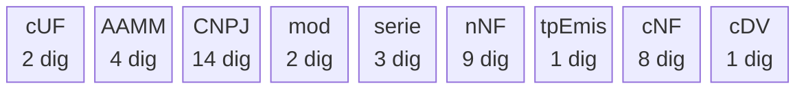
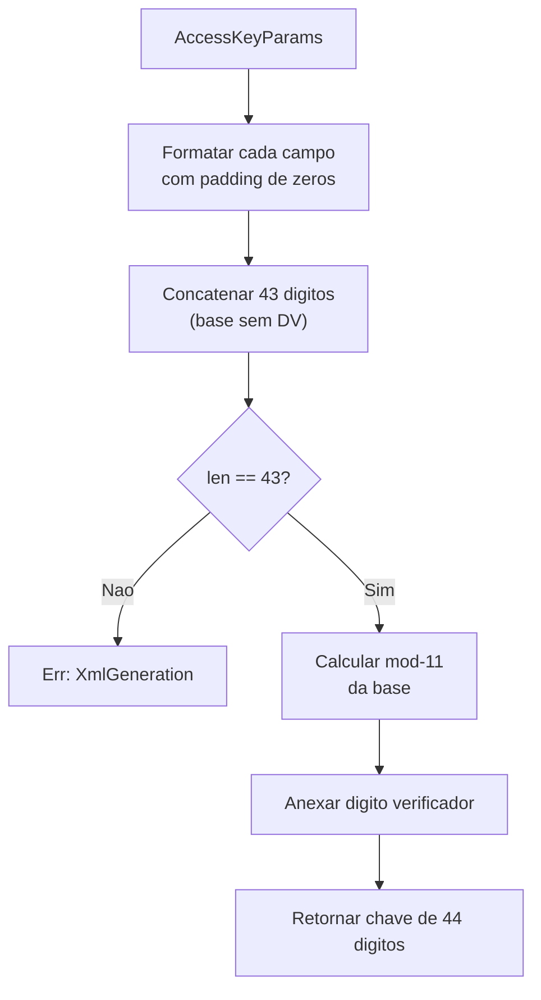
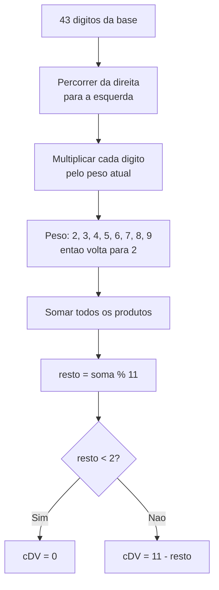
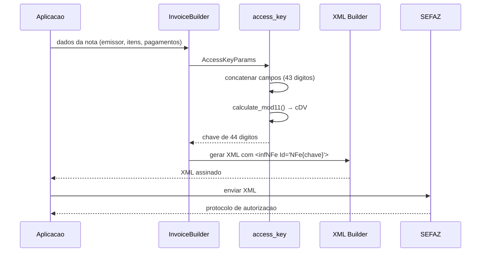

import { Callout } from 'fumadocs-ui/components/callout';

## O que e a chave de acesso?

A **chave de acesso** e um numero de 44 digitos que identifica de forma unica cada documento fiscal eletronico (NF-e ou NFC-e) no Brasil. Ela e gerada pelo emissor antes do envio a SEFAZ e aparece impressa no DANFE como codigo de barras e texto.

No `fiscal-rs`, a geracao da chave e feita pelo modulo `xml_builder::access_key` a partir de um `AccessKeyParams`.

---

## Estrutura dos 44 digitos

A chave de acesso e composta por 9 campos concatenados, totalizando 44 digitos:



| Campo | Tamanho | Descricao | Exemplo |
|-------|---------|-----------|---------|
| **cUF** | 2 | Codigo IBGE da UF do emissor | `43` (RS) |
| **AAMM** | 4 | Ano e mes da emissao (formato AAMM) | `2503` (mar/2025) |
| **CNPJ** | 14 | CNPJ do emissor (com zeros a esquerda) | `04123456000105` |
| **mod** | 2 | Modelo do documento: `55` (NF-e) ou `65` (NFC-e) | `55` |
| **serie** | 3 | Serie do documento (0 a 999) | `001` |
| **nNF** | 9 | Numero da NF-e (1 a 999.999.999) | `000000001` |
| **tpEmis** | 1 | Tipo de emissao (1=Normal, 6=SVC-AN, 7=SVC-RS) | `1` |
| **cNF** | 8 | Codigo numerico aleatorio | `10000001` |
| **cDV** | 1 | Digito verificador (modulo 11) | `7` |

### Exemplo visual

```text
43 2503 04123456000105 55 001 000000001 1 10000001 7
── ──── ────────────── ── ─── ───────── ─ ──────── ─
cUF AAMM     CNPJ      mod ser   nNF   tp  cNF   cDV

Chave completa: 43250304123456000105550010000000011100000017
```

---

## Geracao da chave no codigo

### `AccessKeyParams`

A struct `AccessKeyParams` reune todos os campos necessarios:

```rust
use fiscal_core::types::{AccessKeyParams, InvoiceModel, EmissionType};
use fiscal_core::newtypes::IbgeCode;

let params = AccessKeyParams::new(
    IbgeCode::new("43")?,            // cUF: Rio Grande do Sul
    "2503",                           // AAMM: marco de 2025
    "04123456000105",                 // CNPJ do emissor
    InvoiceModel::Nfe,                // modelo 55
    1,                                // serie
    1,                                // numero da NF-e
    EmissionType::Normal,             // emissao normal
    "10000001",                       // codigo numerico aleatorio
);
```

### `build_access_key`

A funcao `build_access_key` concatena os campos com o padding correto, calcula o digito verificador mod-11 e retorna a chave completa de 44 digitos:

```rust
use fiscal_core::xml_builder::access_key::build_access_key;

let chave = build_access_key(&params)?;
assert_eq!(chave.len(), 44);
// Todos os caracteres sao digitos
assert!(chave.chars().all(|c| c.is_ascii_digit()));
```

O fluxo interno:



<Callout type="warn" title="Validacao de tamanho">
Se a base concatenada nao tiver exatamente 43 digitos, a funcao retorna `Err(FiscalError::XmlGeneration)`. Isso indica que um dos parametros de entrada esta malformado (por exemplo, CNPJ com quantidade incorreta de digitos).
</Callout>

---

## Calculo do digito verificador (mod-11)

O digito verificador (`cDV`) e calculado usando o algoritmo **modulo 11** com pesos ciclicos de 2 a 9, aplicados da direita para a esquerda.

### Algoritmo passo a passo



### Implementacao

```rust
/// Calcula o digito verificador mod-11 para documentos fiscais brasileiros.
/// Pesos ciclam de 2 a 9 da direita para a esquerda.
/// Se o resto apos `% 11` for menor que 2, o digito e 0;
/// caso contrario e `11 - resto`.
pub fn calculate_mod11(digits: &str) -> u8 {
    let mut sum: u32 = 0;
    let mut weight: u32 = 2;

    for ch in digits.bytes().rev() {
        let val = (ch - b'0') as u32;
        sum += val * weight;
        weight = if weight >= 9 { 2 } else { weight + 1 };
    }

    let remainder = sum % 11;
    if remainder < 2 { 0 } else { (11 - remainder) as u8 }
}
```

### Exemplo numerico

Para a base `4325030412345678901255001000000001100000001` (43 digitos):

```text
Digito:  4  3  2  5  0  3  0  4  1  2  3  4  5  6  7  8  9  0  1  2  5  5  0  0  1  0  0  0  0  0  0  0  0  1  1  0  0  0  0  0  0  0  1
Peso:    2  9  8  7  6  5  4  3  2  9  8  7  6  5  4  3  2  9  8  7  6  5  4  3  2  9  8  7  6  5  4  3  2  9  8  7  6  5  4  3  2  9  8
         ↑ direita para esquerda, pesos ciclam 2→9                                                                              esquerda ↑

Soma dos produtos → resto = soma % 11
Se resto < 2 → DV = 0
Se resto >= 2 → DV = 11 - resto
```

---

## Funcoes auxiliares

### Geracao do codigo numerico

O `cNF` e um codigo de 8 digitos gerado para garantir unicidade. O `fiscal-rs` usa os nanossegundos do relogio do sistema com operacoes bit-a-bit:

```rust
use fiscal_core::xml_builder::access_key::generate_numeric_code;

let cnf = generate_numeric_code();
assert_eq!(cnf.len(), 8);
assert!(cnf.chars().all(|c| c.is_ascii_digit()));
```

### Formatacao AAMM

Converte um `DateTime<FixedOffset>` para o formato `AAMM` (ano com 2 digitos + mes com 2 digitos):

```rust
use fiscal_core::xml_builder::access_key::format_year_month;
use chrono::DateTime;

let dt = DateTime::parse_from_rfc3339("2025-03-15T10:30:00-03:00").unwrap();
let aamm = format_year_month(&dt);
assert_eq!(aamm, "2503"); // ano 25, mes 03
```

---

## Fluxo completo

O diagrama abaixo mostra como a chave de acesso se integra no fluxo de emissao de uma NF-e:



<Callout type="info" title="Campo Id do infNFe">
A chave de acesso e usada como atributo `Id` do elemento `<infNFe>` no XML, prefixada com `"NFe"`:
`<infNFe Id="NFe43250304123456000105550010000000011100000017" versao="4.00">`.
Esse mesmo valor e referenciado na assinatura digital (`<Reference URI="#NFe...">`).
</Callout>
