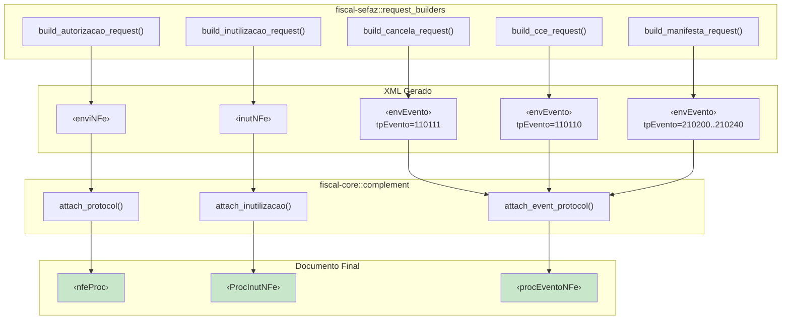
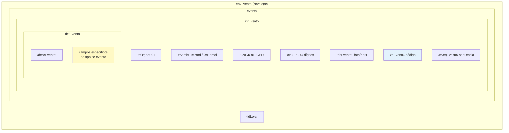

Após a emissão de uma NF-e, diversas operações complementares podem ser necessárias: cancelar o documento, corrigir informações, inutilizar faixas de numeração não utilizadas ou anexar protocolos de autorização. O `fiscal-rs` separa essas responsabilidades em dois módulos:

- **`fiscal-core::complement`** — funções para juntar XMLs de requisição e resposta em documentos de processamento (`nfeProc`, `ProcInutNFe`, `procEventoNFe`).
- **`fiscal-sefaz::request_builders`** — funções para construir os XMLs de requisição enviados ao SEFAZ.

## Tipos de complemento e seus envelopes



## Autorização (enviNFe → nfeProc)

O envelope `<enviNFe>` encapsula um ou mais XMLs de NF-e assinados para envio ao webservice `NFeAutorizacao4`.

### Construir o envelope de autorização

```rust
use fiscal_sefaz::request_builders::build_autorizacao_request;

let envelope = build_autorizacao_request(
    signed_xml,   // XML assinado da NF-e
    "lote_001",   // identificador do lote
    true,         // processamento síncrono (indSinc=1)
    false,        // sem compressão gzip
);
```

O XML gerado tem a seguinte estrutura:

```xml
<enviNFe xmlns="http://www.portalfiscal.inf.br/nfe" versao="4.00">
  <idLote>lote_001</idLote>
  <indSinc>1</indSinc>
  <!-- XML da NFe assinada (sem declaração XML) -->
</enviNFe>
```

### Anexar o protocolo de autorização

Após receber a resposta do SEFAZ, use `attach_protocol` para criar o `<nfeProc>` definitivo:

```rust
use fiscal::complement::attach_protocol;

let nfe_proc = attach_protocol(
    signed_xml,       // XML assinado original (contém <NFe>)
    &response_xml,    // resposta do SEFAZ (contém <protNFe>)
)?;
```

A função executa os seguintes passos internamente:

1. Extrai o elemento `<NFe>` do XML de requisição
2. Extrai o `<protNFe>` da resposta (com matching por digest e chave de acesso)
3. Valida o `cStat` do protocolo contra os status aceitos (`100`, `150`, `110`, `205`, `301`-`303`)
4. Junta ambos em um `<nfeProc>` com namespace e versão

```xml
<?xml version="1.0" encoding="UTF-8"?>
<nfeProc versao="4.00" xmlns="http://www.portalfiscal.inf.br/nfe">
  <NFe><!-- conteúdo completo da NFe assinada --></NFe>
  <protNFe><!-- protocolo de autorização --></protNFe>
</nfeProc>
```

### Erros possíveis

```rust
match attach_protocol(request, response) {
    Ok(nfe_proc) => { /* armazenar */ }
    Err(FiscalError::XmlParsing(msg)) => {
        // XML de requisição sem <NFe> ou resposta sem <protNFe>
        eprintln!("XML inválido: {msg}");
    }
    Err(FiscalError::SefazRejection { code, message }) => {
        // cStat indica rejeição (ex.: "302" — irregularidade do destinatário)
        eprintln!("Rejeitado pelo SEFAZ: [{code}] {message}");
    }
    Err(e) => eprintln!("Erro: {e}"),
}
```

## Inutilização (inutNFe → ProcInutNFe)

A inutilização informa ao SEFAZ que determinados números de NF-e/NFC-e não serão utilizados. Isso é necessário quando números são pulados (ex.: falha do sistema antes da emissão).

### Construir o XML de inutilização

```rust
use fiscal_sefaz::request_builders::build_inutilizacao_request;
use fiscal::types::SefazEnvironment;

let inut_xml = build_inutilizacao_request(
    26,                              // ano (2 dígitos)
    "25028332000105",                // CNPJ do emissor
    "65",                            // modelo ("55" NF-e ou "65" NFC-e)
    1,                               // série
    10,                              // número inicial
    15,                              // número final
    "Falha no sistema durante emissao", // justificativa
    SefazEnvironment::Homologation,
    "SP",                            // UF
);
```

O XML gerado:

```xml
<inutNFe xmlns="http://www.portalfiscal.inf.br/nfe" versao="4.00">
  <infInut Id="ID35262502833200010565001000000010000000015">
    <tpAmb>2</tpAmb>
    <xServ>INUTILIZAR</xServ>
    <cUF>35</cUF>
    <ano>26</ano>
    <CNPJ>25028332000105</CNPJ>
    <mod>65</mod>
    <serie>1</serie>
    <nNFIni>10</nNFIni>
    <nNFFin>15</nNFFin>
    <xJust>Falha no sistema durante emissao</xJust>
  </infInut>
</inutNFe>
```

> O campo `Id` é composto automaticamente: `ID` + código UF + ano + CNPJ + modelo + série + número inicial + número final.

### Assinar e enviar

O XML de inutilização precisa ser assinado antes do envio. A assinatura segue o mesmo padrão `infInut` / `inutNFe`:

```rust
use fiscal::certificate::{load_certificate, sign_xml};
use fiscal_sefaz::client::SefazClient;

let cert = load_certificate(&pfx_bytes, "senha")?;

// Assinar o XML de inutilização
let signed_inut = sign_xml(&inut_xml, &cert.private_key, &cert.certificate)?;

// Enviar ao SEFAZ
let client = SefazClient::new(&pfx_bytes, "senha")?;
let response = client
    .inutilize("SP", SefazEnvironment::Homologation, &signed_inut)
    .await?;
```

### Anexar o protocolo de inutilização

```rust
use fiscal::complement::attach_inutilizacao;

let proc_inut = attach_inutilizacao(&signed_inut, &response)?;
```

A função valida que o `cStat` da resposta é `"102"` (inutilização homologada). Qualquer outro status resulta em `FiscalError::SefazRejection`.

```xml
<?xml version="1.0" encoding="UTF-8"?>
<ProcInutNFe versao="4.00" xmlns="http://www.portalfiscal.inf.br/nfe">
  <inutNFe><!-- requisição assinada --></inutNFe>
  <retInutNFe><!-- resposta do SEFAZ --></retInutNFe>
</ProcInutNFe>
```

## Eventos (envEvento → procEventoNFe)

Os eventos fiscais seguem uma estrutura XML comum encapsulada em `<envEvento>`. Cada tipo de evento é identificado pelo código `tpEvento`.

### Estrutura XML de eventos



### Tipos de evento disponíveis

| Código (`tpEvento`) | Descrição | Constante |
|---|---|---|
| `110110` | Carta de Correção (CC-e) | `event_types::CCE` |
| `110111` | Cancelamento | `event_types::CANCELLATION` |
| `210200` | Confirmação da Operação | `event_types::CONFIRMATION` |
| `210210` | Ciência da Operação | `event_types::AWARENESS` |
| `210220` | Desconhecimento da Operação | `event_types::UNKNOWN_OPERATION` |
| `210240` | Operação não Realizada | `event_types::OPERATION_NOT_PERFORMED` |

### Cancelamento (tpEvento = 110111)

O cancelamento é aplicado a uma NF-e já autorizada. Requer a justificativa (mínimo 15 caracteres) e o número do protocolo de autorização.

```rust
use fiscal_sefaz::request_builders::build_cancela_request;
use fiscal::types::SefazEnvironment;

let cancel_xml = build_cancela_request(
    "35260125028332000105550010000005021234567890", // chave de acesso (44 dígitos)
    "135260100648231",                               // protocolo de autorização
    "Erro na emissao do documento fiscal",           // justificativa (>= 15 chars)
    1,                                                // número sequencial do evento
    SefazEnvironment::Homologation,
    "25028332000105",                                 // CNPJ do emissor
);
```

Envio via client de alto nível:

```rust
let response = client.cancel(
    "SP",
    SefazEnvironment::Homologation,
    "35260125028332000105550010000005021234567890",
    "135260100648231",
    "Erro na emissao do documento fiscal",
    "25028332000105",
).await?;

println!("Status: {} — {}", response.status_code, response.status_message);
```

### Carta de Correção / CC-e (tpEvento = 110110)

A CC-e permite corrigir informações de uma NF-e autorizada, com as seguintes limitações definidas por lei:

- Nao pode alterar valores que determinam o imposto (base de cálculo, alíquota, etc.)
- Nao pode corrigir dados cadastrais que impliquem mudança de remetente ou destinatário
- Nao pode alterar a data de emissão ou saída

O texto legal de condições de uso (`xCondUso`) é inserido automaticamente pela função.

```rust
use fiscal_sefaz::request_builders::build_cce_request;

let cce_xml = build_cce_request(
    "35260125028332000105550010000005021234567890", // chave de acesso
    "Correcao do endereco do destinatario: Rua Correta, 500", // texto da correção
    1,                                                // nSeqEvento (incrementa a cada CC-e)
    SefazEnvironment::Homologation,
    "25028332000105",                                 // CNPJ
);
```

Envio via client de alto nível:

```rust
let response = client.cce(
    "SP",
    SefazEnvironment::Homologation,
    "35260125028332000105550010000005021234567890",
    "Correcao do endereco do destinatario: Rua Correta, 500",
    1,  // seq: primeira correção
    "25028332000105",
).await?;
```

> O `nSeqEvento` deve ser incrementado a cada nova CC-e emitida para a mesma NF-e. A primeira correção usa `1`, a segunda `2`, e assim por diante.

### Manifestação do Destinatário (tpEvento = 210200..210240)

A manifestação permite que o destinatário de uma NF-e confirme, reconheça ou conteste a operação.

```rust
use fiscal_sefaz::request_builders::build_manifesta_request;

// Ciência da operação
let ciencia = build_manifesta_request(
    "35260125028332000105550010000005021234567890",
    "210210",      // Ciência da Operação
    None,          // justificativa não necessária
    1,
    SefazEnvironment::Homologation,
    "17812455000295",  // CNPJ do destinatário
);

// Operação não realizada (requer justificativa)
let nao_realizada = build_manifesta_request(
    "35260125028332000105550010000005021234567890",
    "210240",
    Some("Mercadoria nao foi entregue no endereco informado"),
    1,
    SefazEnvironment::Homologation,
    "17812455000295",
);
```

### Anexar protocolo de evento

Independentemente do tipo de evento, o protocolo é anexado da mesma forma:

```rust
use fiscal::complement::attach_event_protocol;

let proc_evento = attach_event_protocol(
    &event_request_xml,   // XML do evento enviado (contém <evento>)
    &event_response_xml,  // resposta do SEFAZ (contém <retEvento>)
)?;
```

A função valida o `cStat` da resposta contra os status aceitos:

| Código | Significado |
|---|---|
| `135` | Evento registrado e vinculado à NF-e |
| `136` | Evento registrado (não vinculado) |
| `155` | Cancelamento já registrado (fora do prazo) |

Qualquer outro status resulta em `FiscalError::SefazRejection`.

```xml
<?xml version="1.0" encoding="UTF-8"?>
<procEventoNFe versao="1.00" xmlns="http://www.portalfiscal.inf.br/nfe">
  <evento><!-- evento assinado enviado --></evento>
  <retEvento><!-- resposta do SEFAZ --></retEvento>
</procEventoNFe>
```

## Assinatura de eventos

Os XMLs de evento usam uma assinatura diferente dos XMLs de NF-e. O elemento assinado é `<infEvento>` (em vez de `<infNFe>`) e o elemento pai é `<evento>` (em vez de `<NFe>`).

O `fiscal-crypto` fornece uma função dedicada para isso:

```rust
use fiscal::certificate::sign_event_xml;

let signed_event = sign_event_xml(
    &event_xml,
    &cert.private_key,
    &cert.certificate,
)?;
```

> Use `sign_xml()` para NF-e e inutilização. Use `sign_event_xml()` para eventos (cancelamento, CC-e, manifestação).

## B2B (NFeB2BFin) — opcional

O módulo de complementos também suporta a junção de tags financeiras B2B ao `<nfeProc>` autorizado:

```rust
use fiscal::complement::attach_b2b;

let nfe_proc_b2b = attach_b2b(
    &nfe_proc_xml,   // XML <nfeProc> já autorizado
    &b2b_xml,        // XML contendo <NFeB2BFin>
    None,            // tag padrão: "NFeB2BFin"
)?;
```

O resultado é um `<nfeProcB2B>` contendo ambos os documentos.

## Consultas auxiliares

O `fiscal-sefaz` também disponibiliza builders para consultas que não geram documentos de processamento:

### Status do serviço

```rust
use fiscal_sefaz::request_builders::build_status_request;

let xml = build_status_request("SP", SefazEnvironment::Production);
// Gera <consStatServ> — verifica se o SEFAZ está em operação
```

### Consulta por chave de acesso

```rust
use fiscal_sefaz::request_builders::build_consulta_request;

let xml = build_consulta_request(
    "35260125028332000105550010000005021234567890",
    SefazEnvironment::Production,
);
// Gera <consSitNFe> — consulta a situação atual da NF-e
```

### Consulta por recibo (lote assíncrono)

```rust
use fiscal_sefaz::request_builders::build_consulta_recibo_request;

let xml = build_consulta_recibo_request("135260100648231", SefazEnvironment::Production);
// Gera <consReciNFe> — consulta o resultado de um lote assíncrono
```

### Consulta cadastral

```rust
use fiscal_sefaz::request_builders::build_cadastro_request;

let xml = build_cadastro_request("SP", "CNPJ", "25028332000105");
// Gera <ConsCad> — consulta o cadastro do contribuinte
```

### Distribuição de DF-e

```rust
use fiscal_sefaz::request_builders::build_dist_dfe_request;

// Por último NSU
let xml = build_dist_dfe_request(
    "SP", "25028332000105", None, None, SefazEnvironment::Production,
);

// Por chave de acesso
let xml = build_dist_dfe_request(
    "SP", "25028332000105", None,
    Some("35260125028332000105550010000005021234567890"),
    SefazEnvironment::Production,
);
```

## Resumo: qual função usar em cada cenário

| Cenário | Request Builder | Assinatura | Complemento |
|---|---|---|---|
| Emitir NF-e/NFC-e | `build_autorizacao_request` | `sign_xml` | `attach_protocol` |
| Inutilizar numeração | `build_inutilizacao_request` | `sign_xml` | `attach_inutilizacao` |
| Cancelar NF-e | `build_cancela_request` | `sign_event_xml` | `attach_event_protocol` |
| Carta de Correção | `build_cce_request` | `sign_event_xml` | `attach_event_protocol` |
| Manifestação destinatário | `build_manifesta_request` | `sign_event_xml` | `attach_event_protocol` |
| Consultar status | `build_status_request` | -- | -- |
| Consultar NF-e | `build_consulta_request` | -- | -- |
| Consultar recibo | `build_consulta_recibo_request` | -- | -- |
| Anexar B2B | -- | -- | `attach_b2b` |
