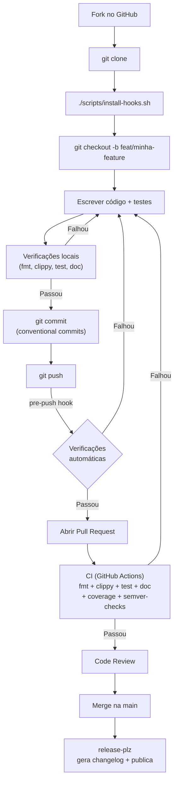
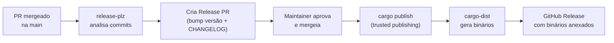

Contribuições são bem-vindas! Este guia cobre tudo o que você precisa para contribuir com o **fiscal-rs**: desde o fork inicial até o merge do seu Pull Request.

## Visão geral do fluxo



## Setup do ambiente

### 1. Fork e clone

```bash
# Fork pelo GitHub, depois:
git clone https://github.com/SEU_USUARIO/fiscal-rs.git
cd fiscal-rs
```

### 2. Toolchain Rust

O projeto usa a edition 2024 com MSRV 1.85. Recomendamos o toolchain stable mais recente:

```bash
rustup update stable
rustup component add clippy rustfmt
```

### 3. Ferramentas recomendadas

```bash
# Testes mais rápidos com output melhor
cargo install cargo-nextest

# Verificação de licenças e vulnerabilidades
cargo install cargo-deny

# Mutation testing (opcional)
cargo install cargo-mutants
```

### 4. Instalar git hooks

O repositório inclui hooks que rodam as mesmas verificações do CI localmente, **antes do push**. Isso evita pushes que falhariam no CI:

```bash
./scripts/install-hooks.sh
```

O script copia os hooks de `scripts/hooks/` para `.git/hooks/` e ajusta as permissões. Atualmente o hook `pre-push` executa:

| Passo | Comando | O que verifica |
|-------|---------|----------------|
| 1 | `cargo fmt --all --check` | Formatação do código |
| 2 | `cargo clippy --all-targets --all-features -- -D warnings` | Lints e warnings |
| 3 | `cargo nextest run --all-features` | Todos os testes (ou `cargo test` como fallback) |
| 4 | `cargo test --doc --all-features` | Doc-tests |
| 5 | `RUSTDOCFLAGS="-D warnings" cargo doc --no-deps --all-features` | Documentação compila sem warnings |
| 6 | `cargo deny check` | Licenças, advisories e bans (se instalado) |

<Callout type="warn">
Se o hook `pre-push` falhar, o push é bloqueado. Corrija os erros indicados e tente novamente. Se precisar pular temporariamente (não recomendado), use `git push --no-verify`.
</Callout>

## Padrões de qualidade

### Formatação (rustfmt)

O projeto usa configuração definida em `rustfmt.toml`:

```toml
edition = "2024"
max_width = 100
use_field_init_shorthand = true
```

Formate seu código antes de commitar:

```bash
cargo fmt --all
```

### Lints (Clippy)

Clippy roda com `-D warnings` — qualquer warning é tratado como erro. A configuração em `clippy.toml`:

```toml
msrv = "1.85"
cognitive-complexity-threshold = 30
```

Verifique localmente:

```bash
cargo clippy --all-targets --all-features -- -D warnings
```

### Licenças e segurança (cargo-deny)

O arquivo `deny.toml` define as políticas do workspace:

- **Licenças permitidas**: MIT, Apache-2.0, BSD-2-Clause, BSD-3-Clause, ISC, Unicode-3.0, Zlib, entre outras licenças permissivas
- **Bans**: dependências wildcard (`*`) são proibidas; múltiplas versões do mesmo crate geram warning
- **Advisories**: vulnerabilidades conhecidas (RustSec) são proibidas; crates não mantidos geram warning
- **Sources**: apenas crates.io e membros do workspace são permitidos como fonte

Verifique localmente:

```bash
cargo deny check
```

### Testes

O fiscal-rs tem 640+ testes portados 1:1 da implementação PHP de referência. Toda contribuição deve incluir testes:

```bash
# Rodar todos os testes
cargo nextest run --all-features

# Rodar doc-tests
cargo test --doc --all-features

# Rodar testes de um módulo específico
cargo nextest run --all-features -p fiscal-core tax_icms
```

**Estratégias de teste usadas no projeto:**

| Estratégia | Ferramenta | Uso |
|---|---|---|
| Testes unitários | `#[test]` | Funções puras, validações |
| Testes de integração | `tests/` | Fluxos completos (build XML, assinar, etc.) |
| Snapshot tests | [insta](https://insta.rs) | Output XML, corpos de request SEFAZ |
| Property-based | [proptest](https://proptest-rs.github.io/proptest/) | Cálculos fiscais, formatação monetária |
| Fuzzing | [cargo-fuzz](https://rust-fuzz.github.io/book/cargo-fuzz.html) | Parsing de XML, TXT-to-XML, certificados |
| Mutation testing | [cargo-mutants](https://mutants.rs) | Lógica crítica de impostos e chave de acesso |

### Documentação

Todo item público deve ter doc-comment (`///`):

```rust
/// Calcula o ICMS para o CST 00 (tributado integralmente).
///
/// # Errors
///
/// Retorna [`FiscalError::InvalidRate`] se a alíquota for negativa.
///
/// # Examples
///
/// ```
/// use fiscal_core::tax::icms::calculate_cst00;
///
/// let result = calculate_cst00(10000, 1800)?;
/// assert_eq!(result.tax_amount, 1800); // R$ 18,00
/// # Ok::<(), fiscal_core::error::FiscalError>(())
/// ```
pub fn calculate_cst00(base: i64, rate: i64) -> Result<IcmsResult, FiscalError> {
    // ...
}
```

Verifique que a documentação compila:

```bash
RUSTDOCFLAGS="-D warnings" cargo doc --no-deps --all-features
```

## Conventional Commits

O projeto usa [Conventional Commits](https://www.conventionalcommits.org/pt-br/) para mensagens de commit padronizadas. Isso permite geração automática de changelog pelo **release-plz**.

### Formato

```
<tipo>(escopo opcional): descrição curta

Corpo opcional com mais detalhes.

Footer opcional (ex: BREAKING CHANGE: ...)
```

### Tipos de commit

| Tipo | Quando usar | Efeito no changelog |
|---|---|---|
| `feat` | Nova funcionalidade | Aparece em "Features" |
| `fix` | Correção de bug | Aparece em "Bug Fixes" |
| `docs` | Apenas documentação | Aparece em "Documentation" |
| `refactor` | Refatoração sem mudar comportamento | Aparece em "Refactor" |
| `test` | Adicionar ou corrigir testes | Aparece em "Testing" |
| `perf` | Melhoria de performance | Aparece em "Performance" |
| `chore` | Manutenção, CI, deps | Não aparece no changelog |
| `ci` | Mudanças no CI/CD | Não aparece no changelog |

### Exemplos

```bash
# Nova funcionalidade
git commit -m "feat(icms): adicionar cálculo de ICMS-ST para CST 10"

# Correção de bug
git commit -m "fix(qrcode): corrigir encoding de caracteres especiais na URL v2"

# Documentação
git commit -m "docs(rustdoc): adicionar exemplos para InvoiceBuilder"

# Refatoração
git commit -m "refactor(xml): extrair lógica de tag builder para módulo separado"

# Breaking change
git commit -m "feat(types)!: renomear InvoiceBuildData para InvoiceData

BREAKING CHANGE: InvoiceBuildData foi renomeado para InvoiceData.
Atualize todas as referências no seu código."
```

<Callout type="info">
Commits com `!` após o tipo (ou com footer `BREAKING CHANGE:`) incrementam a versão major (semver). Use com cautela.
</Callout>

## Fluxo de release (release-plz)

O projeto usa [release-plz](https://release-plz.ieni.dev/) para automatizar releases. O fluxo funciona assim:



1. Quando PRs são mergeados na `main`, o **release-plz** analisa os commits convencionais e determina o bump de versão (patch, minor, major)
2. Ele cria automaticamente um **Release PR** com a versão atualizada no `Cargo.toml` e o `CHANGELOG.md` gerado
3. Quando um maintainer aprova e mergeia o Release PR, o CI publica automaticamente no crates.io
4. O **cargo-dist** gera binários para todas as plataformas suportadas e os anexa ao GitHub Release

## CI/CD (GitHub Actions)

### ci.yml — a cada push e PR

| Passo | Comando | Propósito |
|---|---|---|
| Formatação | `cargo fmt --check` | Código formatado consistentemente |
| Lints | `cargo clippy --all-targets --all-features -- -D warnings` | Sem warnings ou anti-patterns |
| Testes | `cargo nextest run --all-features` | Todos os 640+ testes passam |
| Doc-tests | `cargo test --doc` | Exemplos da documentação compilam |
| Documentação | `cargo doc --no-deps --all-features` | Docs geram sem erros |
| Cobertura | `cargo llvm-cov nextest --lcov` | Relatório enviado ao Codecov |
| Semver | `cargo semver-checks` | Sem quebras acidentais de API |
| Mutação | `cargo mutants --in-diff HEAD~1` | Mutações nos arquivos alterados são detectadas pelos testes |

### audit.yml — diariamente

| Passo | Comando | Propósito |
|---|---|---|
| Licenças + bans | `cargo deny check` | Dependências permitidas |
| Vulnerabilidades | `cargo audit` | Sem CVEs conhecidos (RustSec) |

## Checklist para contribuidores

Antes de abrir seu PR, verifique:

- [ ] `cargo fmt --all` — código formatado
- [ ] `cargo clippy --all-targets --all-features -- -D warnings` — sem warnings
- [ ] `cargo nextest run --all-features` — todos os testes passam
- [ ] `cargo test --doc --all-features` — doc-tests passam
- [ ] Novos itens públicos têm doc-comments com `# Examples`
- [ ] Testes adicionados para novas funcionalidades ou correções
- [ ] Mensagem de commit segue Conventional Commits
- [ ] `cargo deny check` — licenças e advisories OK (se cargo-deny instalado)

<Cards>
  <Card title="Primeiros passos" href="/docs/getting-started" />
  <Card title="Bindings FFI" href="/docs/ffi-bindings" />
  <Card title="Módulos" href="/docs/modules" />
</Cards>
