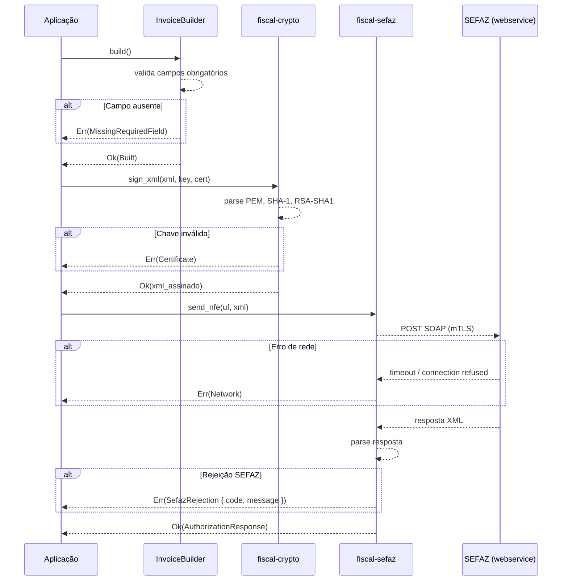

O `fiscal-rs` adota o padrão idiomático de Rust para tratamento de erros: **todas** as funções públicas retornam `Result<T, FiscalError>`. Não há panics, unwraps ocultos ou exceções -- todo erro possível é representado como uma variante tipada do enum `FiscalError`.

## Visão geral do fluxo de erros

O `FiscalError` é definido em `fiscal-core` e reutilizado por todos os crates do workspace. Isso garante que o código do usuário precise tratar apenas **um único tipo de erro**, independentemente de qual camada originou a falha.

```mermaid
flowchart TB
    subgraph core["fiscal-core"]
        direction TB
        A1[Validação de tipos<br/>InvalidTaxData, InvalidGtin]
        A2[Cálculo tributário<br/>UnsupportedIcmsCst, MissingRequiredField]
        A3[Geração XML<br/>XmlGeneration, XmlParsing]
        A4[Contingência<br/>Contingency]
        A5[Conversão TXT<br/>InvalidTxt, WrongDocument]
    end

    subgraph crypto["fiscal-crypto"]
        direction TB
        B1[Carregamento PFX<br/>Certificate]
        B2[Assinatura XML<br/>Certificate]
    end

    subgraph sefaz["fiscal-sefaz"]
        direction TB
        C1[Transporte HTTP<br/>Network]
        C2[Resposta SEFAZ<br/>SefazRejection, XmlParsing]
        C3[URLs/SOAP<br/>InvalidStateCode]
    end

    core --> |"Result&lt;T, FiscalError&gt;"| user["Código do usuário"]
    crypto --> |"Result&lt;T, FiscalError&gt;"| user
    sefaz --> |"Result&lt;T, FiscalError&gt;"| user

    style core fill:#1e293b,stroke:#3b82f6,color:#e2e8f0
    style crypto fill:#1e293b,stroke:#8b5cf6,color:#e2e8f0
    style sefaz fill:#1e293b,stroke:#10b981,color:#e2e8f0
    style user fill:#0f172a,stroke:#f59e0b,color:#fbbf24
```



## O enum `FiscalError`

O tipo central de erro é um enum `#[non_exhaustive]`, derivado com [`thiserror`](https://docs.rs/thiserror). A marcação `#[non_exhaustive]` permite que novas variantes sejam adicionadas em versões futuras sem quebrar código downstream.

```rust
#[derive(Debug, Error, PartialEq, Eq)]
#[non_exhaustive]
pub enum FiscalError {
    InvalidTaxData(String),
    UnsupportedIcmsCst(String),
    UnsupportedIcmsCsosn(String),
    MissingRequiredField { field: String },
    InvalidGtin(String),
    XmlGeneration(String),
    XmlParsing(String),
    SefazRejection { code: String, message: String },
    Certificate(String),
    InvalidStateCode(String),
    Contingency(String),
    InvalidTxt(String),
    WrongDocument(String),
    Network(String),
}
```

### Referência de variantes

| Variante | Crate de origem | Quando ocorre |
|----------|----------------|---------------|
| `InvalidTaxData(String)` | `fiscal-core` | CNPJ mal-formado, campo com tamanho inválido, chave de acesso com formato incorreto |
| `UnsupportedIcmsCst(String)` | `fiscal-core` | Código CST de ICMS não reconhecido pelo módulo de cálculo tributário |
| `UnsupportedIcmsCsosn(String)` | `fiscal-core` | Código CSOSN de ICMS não reconhecido (Simples Nacional) |
| `MissingRequiredField { field }` | `fiscal-core` | Tag XML obrigatória ausente (ex: alíquota ICMS, base de cálculo) |
| `InvalidGtin(String)` | `fiscal-core` | Código de barras GTIN com dígito verificador inválido ou tamanho incorreto |
| `XmlGeneration(String)` | `fiscal-core` | Falha na serialização ou montagem do documento XML |
| `XmlParsing(String)` | `fiscal-core`, `fiscal-sefaz` | Falha ao parsear XML (documento vazio, tag ausente, formato inválido) |
| `SefazRejection { code, message }` | `fiscal-core`, `fiscal-sefaz` | SEFAZ rejeitou o documento com código `cStat` e motivo `xMotivo` |
| `Certificate(String)` | `fiscal-crypto` | Erro ao carregar PFX, parsear certificado, exportar chave ou assinar XML |
| `InvalidStateCode(String)` | `fiscal-core`, `fiscal-sefaz` | Sigla UF ou código IBGE não encontrado na tabela de estados |
| `Contingency(String)` | `fiscal-core` | Erro ao ativar, carregar ou aplicar modo de contingência |
| `InvalidTxt(String)` | `fiscal-core` | Documento TXT com estrutura inválida ou layout não suportado |
| `WrongDocument(String)` | `fiscal-core` | Tipo de documento inesperado (ex: cabeçalho NFC-e quando esperava NF-e) |
| `Network(String)` | `fiscal-sefaz` | Erro HTTP ou de rede na comunicação com os webservices da SEFAZ |

## O padrão `Result<T, FiscalError>`

Toda função pública retorna `Result<T, FiscalError>`. Isso permite o uso do operador `?` para propagar erros automaticamente:

```rust
use fiscal::certificate::{load_certificate, sign_xml};
use fiscal::xml_builder::InvoiceBuilder;
use fiscal_core::FiscalError;

fn emitir_nfe(pfx: &[u8], senha: &str) -> Result<String, FiscalError> {
    // 1. Carrega o certificado -- pode retornar Certificate
    let cert = load_certificate(pfx, senha)?;

    // 2. Constrói a NF-e -- pode retornar MissingRequiredField, InvalidTaxData, etc.
    let built = InvoiceBuilder::new(issuer, env, model)
        .add_item(item)
        .payments(pagamentos)
        .build()?;

    // 3. Assina o XML -- pode retornar Certificate
    let signed = built.sign_with(|xml| {
        sign_xml(xml, &cert.private_key, &cert.certificate)
    })?;

    Ok(signed.signed_xml().to_string())
}
```

O operador `?` propaga o erro para o chamador sem necessidade de conversão manual -- todos os crates usam o mesmo tipo `FiscalError`.

## Propagação entre camadas

O `FiscalError` flui naturalmente das camadas internas para o código do usuário. Cada crate adiciona seus próprios erros usando `map_err` para converter erros de bibliotecas externas (OpenSSL, reqwest, etc.) em variantes de `FiscalError`.



## Exemplos práticos de tratamento

### Match exaustivo nas variantes

```rust
use fiscal_core::FiscalError;

fn tratar_erro(err: FiscalError) {
    match err {
        FiscalError::InvalidTaxData(msg) => {
            eprintln!("Dado fiscal inválido: {msg}");
            // Corrigir o campo e tentar novamente
        }
        FiscalError::MissingRequiredField { field } => {
            eprintln!("Campo obrigatório ausente: {field}");
        }
        FiscalError::Certificate(msg) => {
            eprintln!("Erro de certificado: {msg}");
            // Verificar se o PFX está válido e a senha está correta
        }
        FiscalError::SefazRejection { code, message } => {
            eprintln!("SEFAZ rejeitou [{code}]: {message}");
            // Tratar rejeições conhecidas (ex: 302 = uso denegado)
        }
        FiscalError::Network(msg) => {
            eprintln!("Falha de rede: {msg}");
            // Ativar modo de contingência
        }
        // O atributo #[non_exhaustive] exige wildcard
        other => {
            eprintln!("Erro inesperado: {other}");
        }
    }
}
```

<Callout type="warn">
Como `FiscalError` é `#[non_exhaustive]`, todo `match` **deve** incluir um braço wildcard (`_` ou `other`). Isso garante que seu código continuará compilando quando novas variantes forem adicionadas em versões futuras.
</Callout>

### Verificação com `matches!`

Para verificar rapidamente o tipo de erro sem extrair os dados internos:

```rust
let resultado = load_certificate(&pfx_bytes, "senha_errada");

if let Err(ref e) = resultado {
    if matches!(e, FiscalError::Certificate(_)) {
        eprintln!("Problema com o certificado -- verifique a senha.");
    }
}
```

### Conversão para erro da aplicação

Se a sua aplicação possui um tipo de erro próprio, use `From` ou `map_err`:

```rust
#[derive(Debug)]
enum AppError {
    Fiscal(FiscalError),
    Database(String),
}

impl From<FiscalError> for AppError {
    fn from(e: FiscalError) -> Self {
        AppError::Fiscal(e)
    }
}

fn processar() -> Result<(), AppError> {
    let cert = load_certificate(&pfx, "senha")?; // converte automaticamente
    Ok(())
}
```

## Características do `FiscalError`

O enum implementa traits úteis para diagnóstico e teste:

| Trait | Utilidade |
|-------|-----------|
| `Debug` | Formatação detalhada para logs e depuração |
| `Display` (via `thiserror`) | Mensagens legíveis para o usuário final |
| `Error` (via `thiserror`) | Integração com o ecossistema `std::error::Error` |
| `PartialEq` + `Eq` | Comparação direta em testes (`assert_eq!`) |

```rust
// Display fornece mensagens legíveis
let err = FiscalError::SefazRejection {
    code: "301".into(),
    message: "Uso Denegado".into(),
};
assert_eq!(
    err.to_string(),
    "SEFAZ rejected: [301] Uso Denegado"
);

// PartialEq permite comparação direta em testes
assert_eq!(
    err,
    FiscalError::SefazRejection {
        code: "301".into(),
        message: "Uso Denegado".into(),
    }
);
```

## Boas práticas

1. **Use `?` para propagar** -- não faça `.unwrap()` em código de produção. O tipo unificado `FiscalError` permite encadear chamadas sem conversão.

2. **Trate `SefazRejection` pelo código** -- os códigos de rejeição da SEFAZ (`cStat`) são padronizados. Trate os mais comuns (301, 302, 539, etc.) de forma específica.

3. **Considere contingência em `Network`** -- erros de rede podem indicar que o webservice da SEFAZ está indisponível. Avalie ativar o modo de contingência (SVC-AN, SVC-RS, ou offline).

4. **Use o wildcard `_`** -- por causa de `#[non_exhaustive]`, sempre inclua um braço default no `match` para garantir compatibilidade futura.

5. **Logge com `Debug`, exiba com `Display`** -- use `{:?}` para logs internos (mais detalhado) e `{}` para mensagens ao usuário (mais legível).
