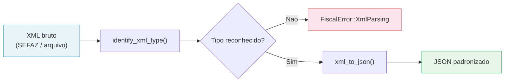
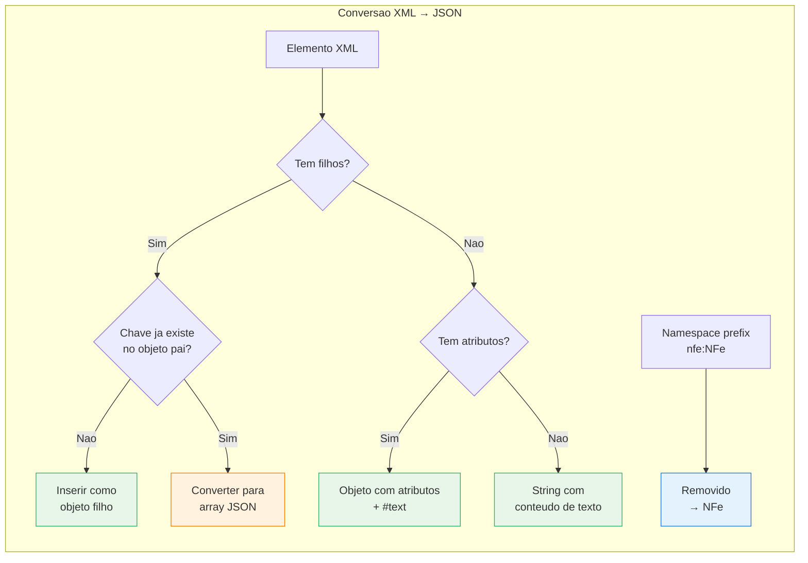
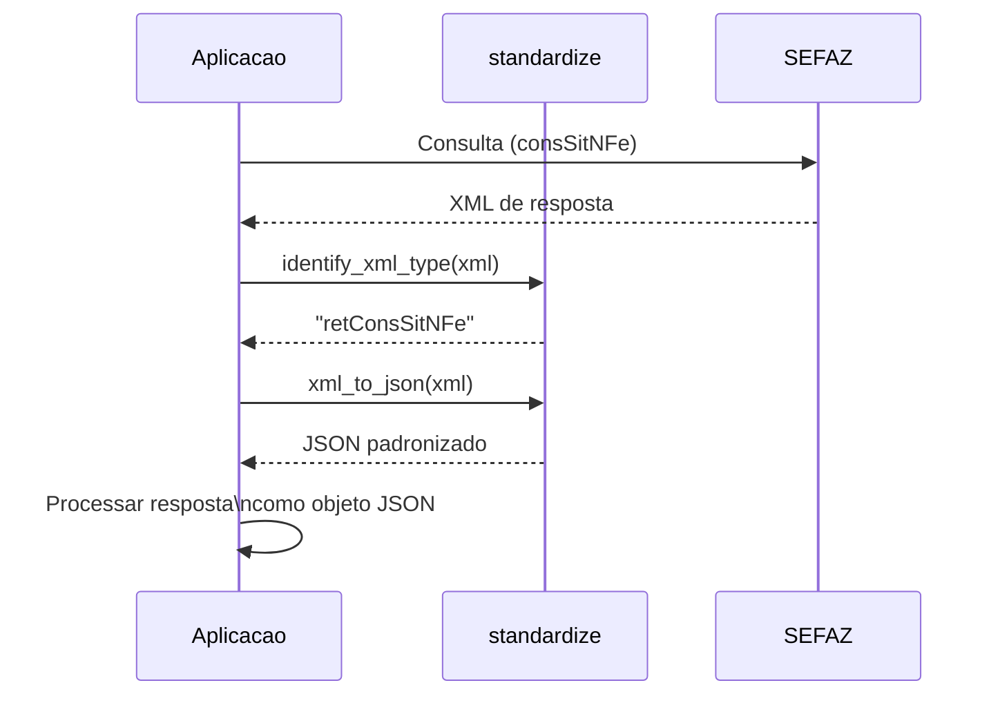

## Visao Geral

O modulo `standardize` do `fiscal-core` oferece funcoes para identificar o tipo de um documento XML de NF-e e converte-lo para uma representacao JSON padronizada. Isso e essencial para tratar a variedade de formatos XML retornados pela SEFAZ e por diferentes emissores.

**Arquivo fonte**: `fiscal-core/src/standardize.rs`



## Por que padronizar?

A comunicacao com os web services da SEFAZ envolve dezenas de tipos diferentes de documentos XML. Cada servico retorna um formato distinto (`retConsSitNFe`, `retEnviNFe`, `nfeProc`, etc.) e as respostas podem conter namespaces, prefixos variados e estruturas aninhadas.

Trabalhar diretamente com XML em aplicacoes modernas traz dificuldades:

- **Namespaces** -- prefixos como `nfe:NFe` variam entre emissores e versoes
- **Deteccao de tipo** -- e preciso saber qual schema o XML segue antes de processa-lo
- **Integracao** -- APIs REST e frontends esperam JSON, nao XML
- **Consistencia** -- normalizar a estrutura facilita validacoes e mapeamentos

O modulo `standardize` resolve esses problemas com duas funcoes complementares.

## Tipos de Documento Reconhecidos

A funcao `identify_xml_type` verifica o elemento raiz do XML contra uma lista de 23 tipos conhecidos:

| Categoria | Tags reconhecidas |
|-----------|-------------------|
| **Distribuicao** | `distDFeInt`, `retDistDFeInt` |
| **Resumos** | `resNFe`, `resEvento` |
| **Eventos** | `envEvento`, `retEnvEvento`, `procEventoNFe` |
| **Cadastro** | `ConsCad`, `retConsCad` |
| **Situacao** | `consSitNFe`, `retConsSitNFe` |
| **Lote** | `consReciNFe`, `retConsReciNFe`, `enviNFe`, `retEnviNFe` |
| **Download** | `downloadNFe`, `retDownloadNFe` |
| **Inutilizacao** | `inutNFe`, `retInutNFe`, `procInutNFe` |
| **CSC (NFC-e)** | `admCscNFCe`, `retAdmCscNFCe` |
| **Status** | `consStatServ`, `retConsStatServ` |
| **NF-e** | `NFe`, `nfeProc`, `procNFe` |

## API Publica

### `identify_xml_type`

Identifica o tipo de um documento XML de NF-e a partir do seu conteudo:

```rust
use fiscal_core::standardize::identify_xml_type;

let xml = r#"<?xml version="1.0"?>
<nfeProc versao="4.00">
  <NFe><infNFe Id="NFe123" /></NFe>
  <protNFe><infProt><cStat>100</cStat></infProt></protNFe>
</nfeProc>"#;

let tipo = identify_xml_type(xml)?;
assert_eq!(tipo, "nfeProc");
```

**Retorno:** `Result<String, FiscalError>` -- o nome da tag raiz identificada.

**Erros:**

| Condicao | Erro |
|----------|------|
| XML vazio ou so espacos | `FiscalError::XmlParsing("XML is empty.")` |
| Nao comeca com `<` | `FiscalError::XmlParsing("Invalid document: not valid XML.")` |
| Tag raiz nao reconhecida | `FiscalError::XmlParsing("Document does not belong to the NFe project.")` |

### `xml_to_json`

Converte um XML de NF-e reconhecido para uma string JSON:

```rust
use fiscal_core::standardize::xml_to_json;

let xml = r#"<NFe xmlns="http://www.portalfiscal.inf.br/nfe">
  <infNFe Id="NFe35200209944445000162550010001234561890123450" versao="4.00">
    <ide>
      <cUF>35</cUF>
      <natOp>VENDA</natOp>
    </ide>
  </infNFe>
</NFe>"#;

let json_str = xml_to_json(xml)?;
println!("{json_str}");
```

**Saida JSON:**

```json
{
  "NFe": {
    "infNFe": {
      "Id": "NFe35200209944445000162550010001234561890123450",
      "versao": "4.00",
      "ide": {
        "cUF": "35",
        "natOp": "VENDA"
      }
    }
  }
}
```

## Regras de Conversao

A conversao XML para JSON segue regras especificas para manter fidelidade ao documento original:



### Detalhamento das regras

| Cenario XML | Resultado JSON |
|-------------|----------------|
| `<cUF>35</cUF>` | `"cUF": "35"` |
| `<infNFe Id="NFe123">...</infNFe>` | `"infNFe": { "Id": "NFe123", ... }` |
| `<el/>` (vazio, sem atributos) | `"el": ""` |
| `<el attr="v"/>` (vazio, com atributos) | `"el": { "attr": "v" }` |
| Elementos repetidos `<det>...<det>...` | `"det": [ {...}, {...} ]` |
| `<nfe:NFe>` (com prefixo de namespace) | `"NFe": { ... }` (prefixo removido) |

### Elementos duplicados viram arrays

Quando o XML tem multiplos elementos com o mesmo nome (como `<det>` para itens de uma nota), a conversao automaticamente agrupa em um array JSON:

```xml
<NFe xmlns="http://www.portalfiscal.inf.br/nfe">
  <infNFe>
    <det nItem="1"><prod><xProd>Produto A</xProd></prod></det>
    <det nItem="2"><prod><xProd>Produto B</xProd></prod></det>
  </infNFe>
</NFe>
```

```json
{
  "NFe": {
    "infNFe": {
      "det": [
        { "nItem": "1", "prod": { "xProd": "Produto A" } },
        { "nItem": "2", "prod": { "xProd": "Produto B" } }
      ]
    }
  }
}
```

## Fluxo Completo de Padronizacao

O fluxo tipico em uma aplicacao fiscal integra ambas as funcoes:



## Implementacao Interna

A conversao e realizada internamente pelo `xml_str_to_json_value`, que utiliza o parser de eventos `quick-xml`:

1. **`Event::Start`** -- empilha o elemento com seus atributos
2. **`Event::Text`** -- armazena o texto como `#text` no elemento atual
3. **`Event::Empty`** -- elemento auto-fechado, inserido diretamente
4. **`Event::End`** -- desempilha e insere no pai, simplificando objetos com apenas `#text`
5. **`Event::CData`** -- tratado como texto

A funcao `strip_ns_prefix` remove prefixos de namespace (ex: `nfe:NFe` vira `NFe`), e `insert_into_map` cuida da logica de duplicatas (elemento unico → valor; segundo com mesma chave → converte para array).

## Casos de Uso

1. **Consulta de situacao** -- parsear o `retConsSitNFe` retornado pela SEFAZ para extrair o `cStat` e `xMotivo`
2. **Distribuicao de DF-e** -- processar o `retDistDFeInt` que contem multiplos documentos compactados
3. **Armazenamento** -- salvar notas em banco de dados no formato JSON, mais acessivel que XML
4. **APIs REST** -- expor dados de documentos fiscais em endpoints JSON para frontends e integracoes
5. **Auditoria** -- normalizar XMLs de diferentes fontes para comparacao e validacao
