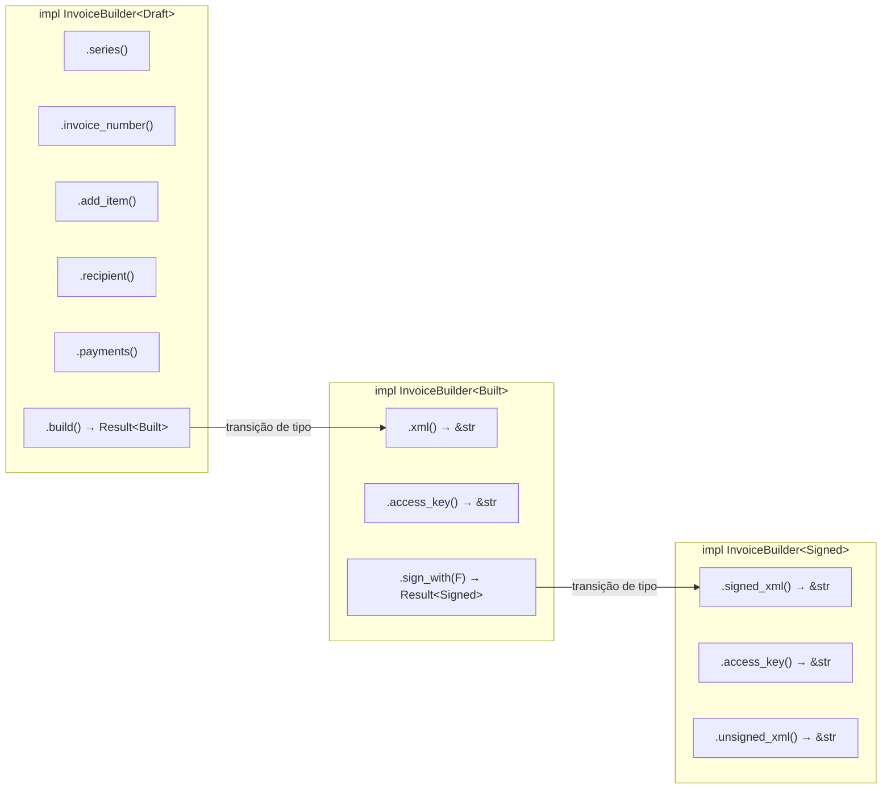

## O que é o padrão Typestate?

O padrão **typestate** codifica o estado de um objeto no sistema de tipos. Em vez de verificar em runtime se uma operação é válida ("o XML já foi gerado?"), o compilador garante que métodos só estejam disponíveis nos estados corretos.

No fiscal-rs, o `InvoiceBuilder` usa três estados representados por structs vazias (chamadas **marcadores** ou *markers*):

```rust
/// Marcador: nota está sendo montada (setters disponíveis, sem XML).
pub struct Draft;

/// Marcador: nota foi construída (XML e chave de acesso disponíveis).
pub struct Built;

/// Marcador: nota foi assinada (XML assinado disponível).
pub struct Signed;
```

A struct `InvoiceBuilder` recebe o estado como **parâmetro de tipo genérico**, com `Draft` como padrão:

```rust
pub struct InvoiceBuilder<State = Draft> {
    // ... campos internos ...
    _state: PhantomData<State>,
}
```

## Por que isso importa para documentos fiscais?

Documentos fiscais no Brasil (NF-e/NFC-e) seguem um fluxo rígido:

1. **Montar** os dados (emitente, destinatário, itens, pagamentos)
2. **Gerar** o XML com a chave de acesso de 44 dígitos
3. **Assinar** digitalmente com certificado A1
4. **Transmitir** à SEFAZ

Pular qualquer etapa resulta em rejeição pela SEFAZ ou, pior, em documentos fiscais inválidos com consequências legais. O typestate torna essas violações **erros de compilação**, não bugs em produção.

## Diagrama de estados

```mermaid
stateDiagram-v2
    [*] --> Draft : InvoiceBuilder::new()

    state Draft {
        [*] --> Configurando
        Configurando --> Configurando : .series() / .add_item() / .recipient() / ...
    }

    Draft --> Built : .build()? ✓ valida e gera XML
    Draft --> Erro_Build : .build()? ✗ dados inválidos

    state Built {
        [*] --> XML_Disponivel
        XML_Disponivel : .xml() → &str
        XML_Disponivel : .access_key() → &str (44 dígitos)
    }

    Built --> Signed : .sign_with(|xml| ...)? ✓
    Built --> Erro_Sign : .sign_with(|xml| ...)? ✗ falha na assinatura

    state Signed {
        [*] --> Assinado
        Assinado : .signed_xml() → &str
        Assinado : .access_key() → &str
        Assinado : .unsigned_xml() → &str
    }

    Signed --> [*] : Pronto para transmissão
```

## O que compila e o que não compila

O grande benefício do typestate é que código incorreto simplesmente **não compila**. O compilador se torna o seu revisor de fluxo fiscal.

### Compila: fluxo correto

```rust
use fiscal_core::xml_builder::InvoiceBuilder;

let signed = InvoiceBuilder::new(issuer, env, model)
    .series(1)
    .invoice_number(42)
    .add_item(item)
    .payments(vec![payment])
    .build()?                              // Draft → Built
    .sign_with(|xml| sign(xml))?;          // Built → Signed

let xml_final = signed.signed_xml();       // ✓ disponível no estado Signed
let chave = signed.access_key();           // ✓ disponível no estado Signed
```

### Nao compila: tentar acessar XML antes de build

```rust
let draft = InvoiceBuilder::new(issuer, env, model)
    .series(1)
    .add_item(item);

// ✗ ERRO DE COMPILAÇÃO:
// o método `xml` não existe para `InvoiceBuilder<Draft>`
let xml = draft.xml();
```

O compilador emite:

```
error[E0599]: no method named `xml` found for struct
              `InvoiceBuilder<Draft>` in the current scope
```

### Nao compila: tentar assinar antes de build

```rust
let draft = InvoiceBuilder::new(issuer, env, model)
    .add_item(item)
    .payments(vec![payment]);

// ✗ ERRO DE COMPILAÇÃO:
// o método `sign_with` não existe para `InvoiceBuilder<Draft>`
let signed = draft.sign_with(|xml| sign(xml))?;
```

### Nao compila: tentar obter signed_xml de Built

```rust
let built = InvoiceBuilder::new(issuer, env, model)
    .add_item(item)
    .payments(vec![payment])
    .build()?;

// ✗ ERRO DE COMPILAÇÃO:
// o método `signed_xml` não existe para `InvoiceBuilder<Built>`
let assinado = built.signed_xml();
```

## Como funciona: PhantomData e blocos impl

### O papel do PhantomData

A struct `InvoiceBuilder` contém um campo `_state: PhantomData<State>`. Esse campo:

- **Não ocupa memória** em runtime (tamanho zero)
- **Vincula** o parâmetro de tipo `State` à struct
- Permite ao compilador tratar `InvoiceBuilder<Draft>` e `InvoiceBuilder<Built>` como **tipos distintos**

```rust
pub struct InvoiceBuilder<State = Draft> {
    issuer: IssuerData,
    environment: SefazEnvironment,
    model: InvoiceModel,
    // ... muitos outros campos ...

    result_xml: Option<String>,           // Some após build
    result_access_key: Option<String>,    // Some após build
    result_signed_xml: Option<String>,    // Some após sign_with

    _state: PhantomData<State>,           // custo zero, marca o estado
}
```

### Blocos impl separados por estado

Cada estado expõe um conjunto diferente de métodos. O compilador simplesmente **não vê** os métodos dos outros estados:



## A transição de estado: consumindo self

Os métodos de transição (`build` e `sign_with`) consomem o builder por valor (`self`, não `&self`). Isso significa que, após chamar `.build()`, o `InvoiceBuilder<Draft>` original **deixa de existir** e você recebe um novo `InvoiceBuilder<Built>`:

```rust
// build() consome o Draft e retorna um Built
pub fn build(self) -> Result<InvoiceBuilder<Built>, FiscalError> {
    // valida dados, gera XML, calcula chave de acesso...
    Ok(InvoiceBuilder {
        // ... transfere todos os campos ...
        result_xml: Some(result.xml),
        result_access_key: Some(result.access_key),
        result_signed_xml: None,
        _state: PhantomData,  // agora marca Built
    })
}
```

Isso garante que você **não pode** continuar usando o builder no estado antigo depois da transição.

## O padrão sign_with: inversão de dependência

O método `sign_with` aceita uma **closure** que recebe o XML não assinado e retorna o XML assinado. Esse design desacopla `fiscal-core` de qualquer implementação criptográfica:

```rust
pub fn sign_with<F>(self, signer: F) -> Result<InvoiceBuilder<Signed>, FiscalError>
where
    F: FnOnce(&str) -> Result<String, FiscalError>,
{
    let unsigned_xml = self.result_xml.as_deref()
        .expect("Built state always has XML");

    let signed_xml = signer(unsigned_xml)?;

    Ok(InvoiceBuilder {
        // ... transfere todos os campos ...
        result_signed_xml: Some(signed_xml),
        _state: PhantomData,
    })
}
```

### Por que uma closure?

```mermaid
flowchart TB
    subgraph "fiscal-core (sem dependência cripto)"
        B["InvoiceBuilder&lt;Built&gt;"]
        S["InvoiceBuilder&lt;Signed&gt;"]
    end

    subgraph "fiscal-crypto (implementação A1)"
        C["sign_xml(xml, key, cert)"]
    end

    subgraph "Seu código"
        U["Carrega certificado .pfx"]
    end

    U --> |"closure"| B
    B --> |".sign_with(&#124;xml&#124; sign_xml(xml, &key, &cert))"| S
    C -.-> |"chamada dentro da closure"| B
```



O `fiscal-core` não depende de OpenSSL, libcrypto ou qualquer crate de assinatura. Quem decide **como** assinar é o chamador:

```rust
// Com fiscal-crypto (certificado A1 real):
let signed = built.sign_with(|xml| {
    fiscal_crypto::certificate::sign_xml(xml, &cert.private_key, &cert.certificate)
})?;

// Em testes (assinatura fake):
let signed = built.sign_with(|xml| {
    Ok(format!("{xml}<Signature>fake</Signature>"))
})?;

// Com HSM ou serviço remoto:
let signed = built.sign_with(|xml| {
    hsm_client.sign(xml).map_err(|e| FiscalError::Certificate(e.to_string()))
})?;
```

## Exemplo completo

```rust
use fiscal_core::xml_builder::InvoiceBuilder;
use fiscal_core::types::*;
use fiscal_core::newtypes::{Cents, IbgeCode, Rate};

// 1. Configurar emissor
let issuer = IssuerData::new(
    "12345678000199", "123456789", "Minha Empresa",
    TaxRegime::SimplesNacional, "SP",
    IbgeCode("3550308".to_string()), "Sao Paulo",
    "Av Paulista", "1000", "Bela Vista", "01310100",
);

// 2. Configurar item
let item = InvoiceItemData::new(
    1, "1", "Produto A", "84715010", "5102", "UN",
    2.0, Cents(1000), Cents(2000),
    "102", Rate(0), Cents(0), "99", "99",
);

// 3. Fluxo completo com typestate
let xml_assinado = InvoiceBuilder::new(
        issuer,
        SefazEnvironment::Homologation,
        InvoiceModel::Nfce,
    )
    .series(1)
    .invoice_number(1)
    .add_item(item)
    .payments(vec![PaymentData::new("01", Cents(2000))])
    .build()?                                    // Draft → Built
    .sign_with(|xml| Ok(xml.to_string()))?       // Built → Signed
    .signed_xml()                                // &str
    .to_string();

// O compilador garantiu que cada etapa foi respeitada.
```

## Comparação: sem typestate vs. com typestate

| | Sem typestate | Com typestate |
|---|---|---|
| **Detecção de erro** | Runtime (`panic!` ou `Result`) | Compilação |
| **Custo em runtime** | Verificações condicionais | Zero (PhantomData) |
| **Documentação** | Comentários "chame build() antes" | O tipo **é** a documentação |
| **Refatoração** | Pode quebrar silenciosamente | Compilador avisa imediatamente |
