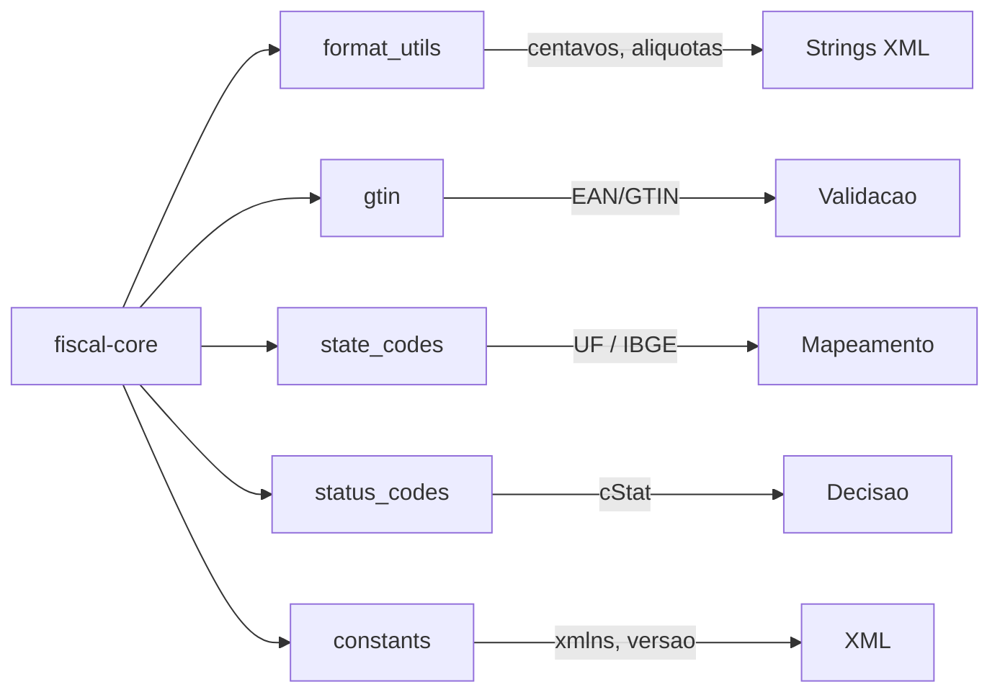
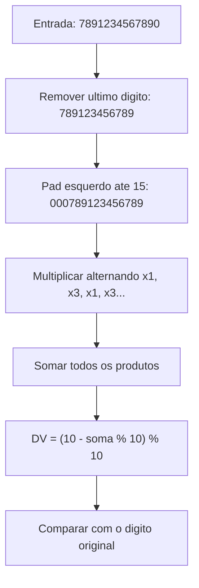
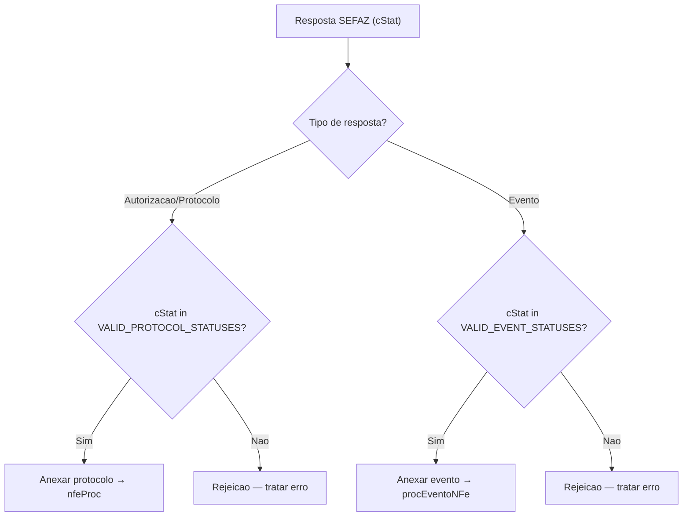

import { Callout } from 'fumadocs-ui/components/callout';

## Visao Geral

O `fiscal-core` expoe varios modulos utilitarios que sao usados internamente pelo XML builder e tambem ficam disponiveis para consumo direto. Eles cobrem quatro areas principais:



---

## Formatacao de valores (`format_utils`)

O fiscal-rs armazena todos os valores monetarios como **inteiros em centavos** (`i64`) e aliquotas como **inteiros escalados**, eliminando erros de ponto flutuante. As funcoes de formatacao convertem esses inteiros para strings decimais prontas para insercao em elementos XML.

### `format_cents` — valor monetario

Converte centavos para string decimal com o numero de casas especificado:

```rust
use fiscal_core::format_utils::format_cents;

// R$ 10,50 armazenado como 1050 centavos
assert_eq!(format_cents(1050, 2), "10.50");

// Preco unitario com 10 casas decimais
assert_eq!(format_cents(100000, 10), "1000.0000000000");
```

Atalhos disponiveis:

| Funcao | Casas decimais | Uso tipico |
|--------|---------------|------------|
| `format_cents_2(cents)` | 2 | `vProd`, `vNF`, `vDesc` |
| `format_cents_10(cents)` | 10 | `vUnCom`, `vUnTrib` (preco unitario) |

```rust
use fiscal_core::format_utils::{format_cents_2, format_cents_10};

assert_eq!(format_cents_2(1050), "10.50");
assert_eq!(format_cents_2(0), "0.00");
assert_eq!(format_cents_10(100000), "1000.0000000000");
```

### `format_rate` — aliquota percentual

Aliquotas sao armazenadas como **centesimos de porcento** (ex.: 18,00% = `1800`). A funcao divide por 100 e formata:

```rust
use fiscal_core::format_utils::{format_rate, format_rate_4};

// 18.00% armazenado como 1800
assert_eq!(format_rate(1800, 4), "18.0000");
assert_eq!(format_rate(750, 2), "7.50");

// Atalho com 4 casas decimais
assert_eq!(format_rate_4(1800), "18.0000");
```

### `format_rate4` — aliquota PIS/COFINS

Para PIS e COFINS, as aliquotas sao armazenadas como **valor multiplicado por 10.000** (ex.: 1,65% = `16500`). A funcao divide por 10.000:

```rust
use fiscal_core::format_utils::format_rate4;

// 1.65% armazenado como 16500
assert_eq!(format_rate4(16500), "1.6500");
```

### `format_decimal` — valor generico

Formata um `f64` com o numero de casas decimais especificado:

```rust
use fiscal_core::format_utils::format_decimal;

assert_eq!(format_decimal(3.14159, 2), "3.14");
```

### Variantes `Option`

Para campos opcionais do XML, existem wrappers que tratam `None`:

```rust
use fiscal_core::format_utils::{format_cents_or_none, format_cents_or_zero, format_rate4_or_zero};

// Retorna None quando o valor e None (campo omitido no XML)
assert_eq!(format_cents_or_none(None, 2), None);
assert_eq!(format_cents_or_none(Some(500), 2), Some("5.00".to_string()));

// Retorna "0.00" quando o valor e None (campo presente com valor zero)
assert_eq!(format_cents_or_zero(None, 2), "0.00");
assert_eq!(format_cents_or_zero(Some(500), 2), "5.00");

// Aliquota PIS/COFINS com fallback para zero
assert_eq!(format_rate4_or_zero(None), "0.0000");
assert_eq!(format_rate4_or_zero(Some(16500)), "1.6500");
```

<Callout type="info" title="Por que inteiros?">
Usar centavos como `i64` em vez de `f64` elimina erros classicos como `0.1 + 0.2 != 0.3`. A conversao para string decimal acontece apenas na hora de gerar o XML, garantindo precisao em toda a cadeia de calculo.
</Callout>

---

## Validacao GTIN (`gtin`)

Valida codigos de barras (GTIN-8, GTIN-12, GTIN-13, GTIN-14) usados nos campos `<cEAN>` e `<cEANTrib>` dos itens da NF-e.

```rust
use fiscal_core::gtin::is_valid_gtin;

// Produtos sem codigo de barras
assert_eq!(is_valid_gtin(""), Ok(true));
assert_eq!(is_valid_gtin("SEM GTIN"), Ok(true));

// GTIN valido
assert!(is_valid_gtin("7891234567890").is_ok());

// Erros de validacao
assert!(is_valid_gtin("ABC").is_err());        // caracteres nao numericos
assert!(is_valid_gtin("12345").is_err());       // comprimento invalido
assert!(is_valid_gtin("7891234567891").is_err()); // digito verificador incorreto
```

### Algoritmo do digito verificador

O calculo segue o padrao GS1. Os digitos (exceto o ultimo) sao preenchidos a esquerda com zeros ate 15 posicoes, e entao multiplicados alternadamente por **1** e **3**:



```rust
use fiscal_core::gtin::calculate_check_digit;

// Calcula o digito verificador esperado
let dv = calculate_check_digit("7891234567890").unwrap();
// dv == ultimo digito do GTIN se valido
```

### Comprimentos aceitos

| Formato | Digitos | Uso |
|---------|---------|-----|
| GTIN-8 | 8 | Embalagens pequenas |
| GTIN-12 | 12 | UPC (EUA/Canada) |
| GTIN-13 | 13 | EAN-13 (padrao brasileiro) |
| GTIN-14 | 14 | Caixas e paletes |

---

## Codigos de estado IBGE (`state_codes`)

Mapeamento bidirecional entre a sigla do estado (UF) e o codigo numerico do IBGE. Usado na construcao da chave de acesso, resolucao de endpoints SEFAZ e modulos de contingencia.

### Mapas estaticos

```rust
use fiscal_core::state_codes::{STATE_IBGE_CODES, IBGE_TO_UF};

// UF → codigo IBGE
assert_eq!(STATE_IBGE_CODES.get("SP"), Some(&"35"));
assert_eq!(STATE_IBGE_CODES.get("PR"), Some(&"41"));
assert_eq!(STATE_IBGE_CODES.get("RJ"), Some(&"33"));

// Codigo IBGE → UF (reverso)
assert_eq!(IBGE_TO_UF.get("35"), Some(&"SP"));
assert_eq!(IBGE_TO_UF.get("41"), Some(&"PR"));
```

### Funcoes com tratamento de erro

```rust
use fiscal_core::state_codes::{get_state_code, get_state_by_code};

// Retorna Ok com o codigo IBGE
let code = get_state_code("MG").unwrap();
assert_eq!(code, "31");

// Retorna Err para UF desconhecida
assert!(get_state_code("XX").is_err());

// Busca reversa
let uf = get_state_by_code("43").unwrap();
assert_eq!(uf, "RS");
```

### Tabela completa

| UF | Codigo | UF | Codigo | UF | Codigo |
|----|--------|----|--------|----|--------|
| AC | 12 | MA | 21 | RJ | 33 |
| AL | 27 | MT | 51 | RN | 24 |
| AP | 16 | MS | 50 | RO | 11 |
| AM | 13 | MG | 31 | RR | 14 |
| BA | 29 | PA | 15 | RS | 43 |
| CE | 23 | PB | 25 | SC | 42 |
| DF | 53 | PR | 41 | SE | 28 |
| ES | 32 | PE | 26 | SP | 35 |
| GO | 52 | PI | 22 | TO | 17 |

---

## Codigos de status SEFAZ (`status_codes`)

Constantes nomeadas para os codigos de resposta (`cStat`) retornados pelos web services da SEFAZ. Baseados no Manual de Orientacao do Contribuinte (MOC) v7.0+.

### Constantes principais

```rust
use fiscal_core::status_codes::sefaz_status;

// Autorizacao
let _ = sefaz_status::AUTHORIZED;           // "100" - Autorizado o uso da NF-e
let _ = sefaz_status::AUTHORIZED_LATE;      // "150" - Autorizado fora do prazo

// Cancelamento
let _ = sefaz_status::CANCELLED;            // "101" - Cancelamento homologado
let _ = sefaz_status::ALREADY_CANCELLED;    // "155" - Ja cancelada (fora do prazo)

// Inutilizacao
let _ = sefaz_status::VOIDED;               // "102" - Inutilizacao homologada

// Denegacao
let _ = sefaz_status::DENIED;               // "110" - Uso denegado
let _ = sefaz_status::DENIED_IN_DATABASE;   // "205" - Denegado na base da SEFAZ
let _ = sefaz_status::DENIED_ISSUER_IRREGULAR;     // "301" - Emitente irregular
let _ = sefaz_status::DENIED_RECIPIENT_IRREGULAR;  // "302" - Destinatario irregular
let _ = sefaz_status::DENIED_RECIPIENT_NOT_ENABLED; // "303" - Destinatario nao habilitado

// Eventos
let _ = sefaz_status::EVENT_REGISTERED;          // "135" - Evento registrado
let _ = sefaz_status::EVENT_ALREADY_REGISTERED;  // "136" - Evento ja registrado

// Servico
let _ = sefaz_status::SERVICE_RUNNING;      // "107" - Servico em operacao
let _ = sefaz_status::DUPLICATE;            // "204" - NF-e duplicada
```

### Conjuntos de status validos

O modulo expoe dois slices usados para validar se um protocolo ou evento pode ser anexado ao documento:

```rust
use fiscal_core::status_codes::{VALID_PROTOCOL_STATUSES, VALID_EVENT_STATUSES};

// Status que permitem anexar protocolo (nfeProc)
// ["100", "150", "110", "205", "301", "302", "303"]
assert!(VALID_PROTOCOL_STATUSES.contains(&"100"));

// Status que permitem anexar evento (procEventoNFe)
// ["135", "136", "155"]
assert!(VALID_EVENT_STATUSES.contains(&"135"));
```



---

## Constantes XML (`constants`)

Valores fixos usados na geracao de XML e comunicacao com os web services SEFAZ.

### Namespaces e algoritmos

```rust
use fiscal_core::constants::*;

// Namespace principal da NF-e
assert_eq!(NFE_NAMESPACE, "http://www.portalfiscal.inf.br/nfe");

// Assinatura digital XML
assert_eq!(XMLDSIG_NAMESPACE, "http://www.w3.org/2000/09/xmldsig#");

// Canonicalizacao C14N
assert_eq!(C14N_ALGORITHM, "http://www.w3.org/TR/2001/REC-xml-c14n-20010315");

// Transform de assinatura envelopada
assert_eq!(
    ENVELOPED_SIGNATURE_TRANSFORM,
    "http://www.w3.org/2000/09/xmldsig#enveloped-signature"
);

// Versao da NF-e
assert_eq!(NFE_VERSION, "4.00");

// SOAP para web services
assert_eq!(SOAP_ENVELOPE_NS, "http://www.w3.org/2003/05/soap-envelope");

// WSDL da NF-e
assert_eq!(NFE_WSDL_NS, "http://www.portalfiscal.inf.br/nfe/wsdl");
```

### Tipos de pagamento (`payment_types`)

Codigos `tPag` da especificacao NF-e, usados no campo `method` de `PaymentData`:

```rust
use fiscal_core::constants::payment_types;
use fiscal_core::types::PaymentData;
use fiscal_core::newtypes::Cents;

let pagamento_pix = PaymentData::new(payment_types::PIX, Cents(10000));
assert_eq!(pagamento_pix.method, "17");
```

| Constante | Codigo | Descricao |
|-----------|--------|-----------|
| `CASH` | `"01"` | Dinheiro |
| `CHECK` | `"02"` | Cheque |
| `CREDIT_CARD` | `"03"` | Cartao de credito |
| `DEBIT_CARD` | `"04"` | Cartao de debito |
| `STORE_CREDIT` | `"05"` | Credito loja |
| `VOUCHER` | `"10"` | Vale alimentacao/refeicao |
| `PIX` | `"17"` | Pix |
| `NONE` | `"90"` | Sem pagamento |
| `OTHER` | `"99"` | Outros |
