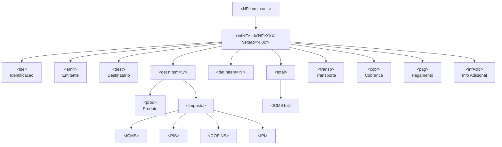
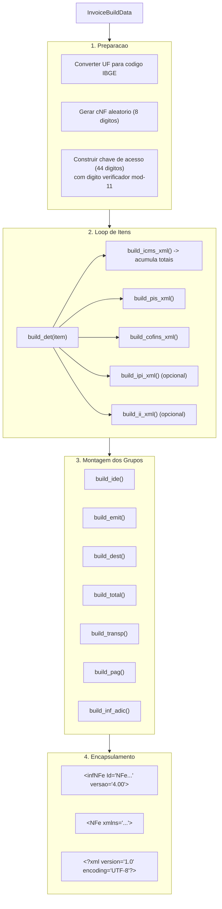

## Visao Geral

A camada de geracao de XML constroi documentos XML completos e nao assinados de NF-e/NFC-e conforme a especificacao MOC 4.00. Apos a geracao, o XML e assinado com certificado digital (via `fiscal-crypto`) e enviado ao SEFAZ.

**Arquivos-fonte**: `xml_builder/mod.rs`, `xml_builder/builder.rs`, `xml_builder/ide.rs`, `xml_builder/emit.rs`, `xml_builder/dest.rs`, `xml_builder/det.rs`, `xml_builder/total.rs`, `xml_builder/transp.rs`, `xml_builder/pag.rs`, `xml_builder/optional.rs`, `xml_utils.rs`

## Estrutura XML da NF-e



### XML Resultante (Simplificado)

```xml
<?xml version="1.0" encoding="UTF-8"?>
<NFe xmlns="http://www.portalfiscal.inf.br/nfe">
  <infNFe Id="NFe35..." versao="4.00">
    <ide>...</ide>
    <emit>
      <enderEmit>...</enderEmit>
    </emit>
    <dest>
      <enderDest>...</enderDest>
    </dest>
    <det nItem="1">
      <prod>...</prod>
      <imposto>
        <ICMS><ICMS00>...</ICMS00></ICMS>
        <PIS><PISAliq>...</PISAliq></PIS>
        <COFINS><COFINSAliq>...</COFINSAliq></COFINS>
      </imposto>
    </det>
    <total>
      <ICMSTot>...</ICMSTot>
    </total>
    <transp>...</transp>
    <pag>...</pag>
    <infAdic>...</infAdic>
  </infNFe>
</NFe>
```

## Utilitarios XML (`xml_utils.rs`)

### Funcao `tag()`

O nucleo da construcao de XML e a funcao `tag()`, que monta elementos XML com escape automatico:

```rust
pub fn tag(name: &str, attrs: &[(&str, &str)], children: TagContent<'_>) -> String
```

### Enum `TagContent`

O `TagContent` controla o tipo de conteudo de cada tag:

```rust
pub enum TagContent<'a> {
    None,              // elemento vazio: <tag></tag>
    Text(&'a str),     // texto com escape: <tag>texto</tag>
    Children(Vec<String>), // filhos pre-construidos (concatenados cru)
}
```

### Comportamento e Exemplos

**Texto com escape automatico:**

```rust
tag("xNome", &[], TagContent::Text("Foo & Bar"))
// Resultado: <xNome>Foo &amp; Bar</xNome>
```

**Elemento com atributos:**

```rust
tag("det", &[("nItem", "1")], TagContent::Children(vec![...]))
// Resultado: <det nItem="1">...</det>
```

**Elemento vazio:**

```rust
tag("COFINSNT", &[], TagContent::None)
// Resultado: <COFINSNT></COFINSNT>
```

**Filhos pre-construidos (sem re-escape):**

```rust
tag("imposto", &[], TagContent::Children(vec![
    icms_xml,    // ja e uma string XML
    pis_xml,
    cofins_xml,
]))
// Resultado: <imposto><ICMS>...</ICMS><PIS>...</PIS><COFINS>...</COFINS></imposto>
```

### Funcoes Auxiliares

| Funcao | Descricao |
|--------|-----------|
| `escape_xml(s)` | Escapa `&`, `<`, `>`, `"`, `'` para entidades XML |
| `extract_xml_tag_value(xml, tag)` | Extrai o conteudo texto da primeira ocorrencia de uma tag |

## Fluxo de Construcao (`xml_builder/mod.rs`)

A funcao interna `generate_xml()` orquestra a montagem completa da NF-e:



## Secoes do XML em Detalhe

### `<ide>` -- Identificacao (`ide.rs`)

Contem os dados de identificacao do documento fiscal:

```rust
pub(crate) fn build_ide(
    data: &InvoiceBuildData,
    state_ibge: &str,
    numeric_code: &str,
    access_key: &str,
) -> String
```

| Campo | Descricao | Exemplo |
|-------|-----------|---------|
| `cUF` | Codigo IBGE do estado | `"35"` (SP) |
| `cNF` | Codigo numerico aleatorio | `"12345678"` |
| `natOp` | Natureza da operacao | `"VENDA"` |
| `mod` | Modelo (55=NF-e, 65=NFC-e) | `"65"` |
| `serie` | Serie do documento | `"1"` |
| `nNF` | Numero da NF | `"42"` |
| `dhEmi` | Data/hora de emissao (ISO 8601) | `"2026-01-15T10:30:00-03:00"` |
| `tpEmis` | Tipo de emissao (1=normal, 9=contingencia) | `"1"` |
| `cDV` | Digito verificador da chave | `"7"` |
| `tpAmb` | Ambiente (1=producao, 2=homologacao) | `"2"` |

A funcao `format_datetime_nfe()` formata datas com offset por estado (AC usa `-05:00`, AM/RO/RR/MT/MS usa `-04:00`, demais usam `-03:00`) pois a SEFAZ rejeita o sufixo UTC `"Z"`.

### `<emit>` -- Emitente (`emit.rs`)

Dados do emitente da nota fiscal:

```rust
pub(crate) fn build_emit(data: &InvoiceBuildData) -> String
```

Inclui `CNPJ`, `xNome`, `xFant` (opcional), `enderEmit` (endereco completo) e `CRT` (codigo do regime tributario: 1=Simples, 2=Simples Excesso, 3=Normal).

O helper `build_address_fields()` e reutilizado para gerar a sequencia padrao de tags de endereco (`xLgr`, `nro`, `xCpl`, `xBairro`, `cMun`, `xMun`, `UF`, `CEP`, `cPais`, `xPais`), compartilhado entre `emit`, `dest`, `retirada` e `entrega`.

### `<dest>` -- Destinatario (`dest.rs`)

Dados do destinatario. Opcional para NFC-e abaixo de R$200. Para NF-e (modelo 55), inclui endereco completo com fallback para o endereco do emitente quando campos estao vazios.

```rust
pub(crate) fn build_dest(data: &InvoiceBuildData) -> Option<String>
```

O `TaxId` helper detecta automaticamente se o documento e CPF (11 digitos) ou CNPJ (14 digitos) e gera a tag correta.

### `<det>` -- Detalhe do Item (`det.rs`)

Cada item gera um elemento `<det nItem="N">` contendo `<prod>` e `<imposto>`:

```rust
pub(crate) fn build_det(
    item: &InvoiceItemData,
    data: &InvoiceBuildData,
) -> Result<DetResult, FiscalError>
```

O `DetResult` retorna o XML serializado junto com os totais acumulados:

```rust
pub struct DetResult {
    pub xml: String,
    pub icms_totals: IcmsTotals,
    pub v_ipi: i64,
    pub v_pis: i64,
    pub v_cofins: i64,
    pub v_ii: i64,
}
```

**Secao `<prod>`** inclui: `cProd`, `cEAN`, `xProd`, `NCM`, `CEST` (opcional), `CFOP`, `uCom`, `qCom`, `vUnCom`, `vProd`, `cEANTrib`, `uTrib`, `qTrib`, `vUnTrib`, `vFrete?`, `vSeg?`, `vDesc?`, `vOutro?`, `indTot`.

**Secao `<imposto>`** monta os XMLs de impostos na ordem do schema: ICMS, IPI (se presente), PIS, COFINS, II (se presente).

**Opcoes especiais de produto**: `rastro` (rastreabilidade por lote), `veicProd` (veiculos), `med` (medicamentos ANVISA), `arma` (armamentos), `nRECOPI`.

### `<total>` -- Totais (`total.rs`)

Constroi `<total>` com o subgrupo `<ICMSTot>` acumulando todos os totais de ICMS e demais impostos:

```rust
pub fn build_total(
    total_products: i64,
    icms: &IcmsTotals,
    other: &OtherTotals,
    ret_trib: Option<&RetTribData>,
) -> String
```

Inclui 21+ campos obrigatorios como `vBC`, `vICMS`, `vICMSDeson`, `vBCST`, `vST`, `vFCP`, `vProd`, `vIPI`, `vPIS`, `vCOFINS`, `vNF`, entre outros.

O grupo opcional `<retTrib>` (retencao tributaria) suporta: `vRetPIS`, `vRetCOFINS`, `vRetCSLL`, `vBCIRRF`, `vIRRF`, `vBCRetPrev`, `vRetPrev`.

### `<transp>` -- Transporte (`transp.rs`)

Dados de transporte com modalidade de frete. Se nenhum dado de transporte for informado, gera `<transp><modFrete>9</modFrete></transp>` (sem frete).

Subgrupos opcionais:
- `<retTransp>` -- ICMS retido no transporte
- `<transporta>` -- dados da transportadora (CNPJ/CPF, nome, IE)
- `<veicTransp>` -- veiculo de transporte (placa, UF, RNTC)
- `<reboque>` -- reboques/carretas
- `<vol>` -- volumes (quantidade, especie, peso liquido/bruto, lacres)

### `<cobr>` -- Cobranca (`optional.rs`)

Grupo opcional para faturamento e duplicatas:

```rust
pub fn build_cobr(billing: &BillingData) -> String
```

- `<fat>` -- fatura: numero, valor original, desconto, valor liquido
- `<dup>` -- duplicatas: numero, data de vencimento, valor

### `<pag>` -- Pagamento (`pag.rs`)

Lista de formas de pagamento:

```rust
pub fn build_pag(
    payments: &[PaymentData],
    change_amount: Option<Cents>,
    card_details: Option<&[PaymentCardDetail]>,
) -> String
```

Cada `<detPag>` contem `tPag` (tipo: 01=dinheiro, 03=cartao credito, etc.) e `vPag` (valor). Opcionalmente inclui `<card>` com dados de integracao, bandeira e autorizacao.

Apos todos os `<detPag>`, o campo `<vTroco>` (troco) e adicionado se houver valor positivo.

### `<infAdic>` -- Informacoes Adicionais (`optional.rs`)

Informacoes complementares do documento:

```rust
pub(crate) fn build_inf_adic(data: &InvoiceBuildData) -> String
```

- `<infAdFisco>` -- informacoes para o fisco
- `<infCpl>` -- informacoes complementares (inclui notas de contingencia e homologacao automaticamente)
- `<obsCont>` -- observacoes do contribuinte (max 10)
- `<obsFisco>` -- observacoes do fisco (max 10)
- `<procRef>` -- referencias de processos (max 100)

### Grupos Opcionais Adicionais

| Funcao | Tag XML | Uso |
|--------|---------|-----|
| `build_withdrawal()` | `<retirada>` | Endereco de retirada |
| `build_delivery()` | `<entrega>` | Endereco de entrega |
| `build_aut_xml()` | `<autXML>` | Partes autorizadas a baixar o XML |
| `build_intermediary()` | `<infIntermed>` | Dados do intermediador |
| `build_tech_responsible()` | `<infRespTec>` | Responsavel tecnico |
| `build_purchase()` | `<compra>` | Dados de compra (pedido, contrato) |
| `build_export()` | `<exporta>` | Dados de exportacao |

## Exemplo Completo

```rust
use fiscal_core::xml_builder::InvoiceBuilder;
use fiscal_core::types::*;
use fiscal_core::newtypes::{Cents, IbgeCode, Rate};

// 1. Criar o emitente
let issuer = IssuerData::new(
    "12345678000199",  // CNPJ
    "123456789",        // IE
    "Minha Empresa LTDA",
    TaxRegime::SimplesNacional,
    "SP",
    IbgeCode("3550308".to_string()),
    "Sao Paulo",
    "Av Paulista",
    "1000",
    "Bela Vista",
    "01310100",
).trade_name("Minha Loja");

// 2. Criar um item
let item = InvoiceItemData::new(
    1,              // nItem
    "PROD001",      // cProd
    "Camiseta Preta M",
    "61091000",     // NCM
    "5102",         // CFOP
    "UN",           // unidade
    2.0,            // quantidade
    Cents(5990),    // preco unitario (R$59,90)
    Cents(11980),   // preco total (R$119,80)
    "102",          // ICMS CST/CSOSN
    Rate(0),        // aliquota ICMS
    Cents(0),       // valor ICMS
    "07",           // PIS CST
    "07",           // COFINS CST
);

// 3. Criar pagamento
let payment = PaymentData::new("01", Cents(11980)); // dinheiro

// 4. Construir e assinar
let signed = InvoiceBuilder::new(
    issuer,
    SefazEnvironment::Homologation,
    InvoiceModel::Nfce,
)
    .series(1)
    .invoice_number(42)
    .add_item(item)
    .payments(vec![payment])
    .build()?                          // Draft -> Built
    .sign_with(|xml| sign(xml))?;      // Built -> Signed

let xml_final = signed.signed_xml();
let chave = signed.access_key(); // 44 digitos
```

## Ordem dos Grupos no Schema

A ordem dos filhos de `<infNFe>` e rigida e segue o schema da SEFAZ. O `generate_xml()` respeita essa ordem:

1. `<ide>` -- identificacao
2. `<emit>` -- emitente
3. `<dest>` -- destinatario (opcional NFC-e)
4. `<retirada>` -- local de retirada (opcional)
5. `<entrega>` -- local de entrega (opcional)
6. `<autXML>` -- autorizados (opcional, multiplos)
7. `<det>` -- itens (1..990)
8. `<total>` -- totais
9. `<transp>` -- transporte
10. `<cobr>` -- cobranca (opcional)
11. `<pag>` -- pagamento
12. `<infIntermed>` -- intermediador (opcional)
13. `<infAdic>` -- informacoes adicionais
14. `<exporta>` -- exportacao (opcional)
15. `<compra>` -- dados de compra (opcional)
16. `<infRespTec>` -- responsavel tecnico (opcional)
